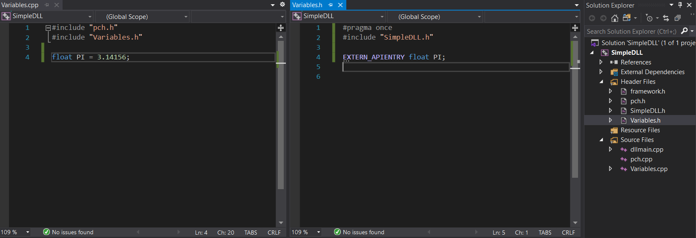
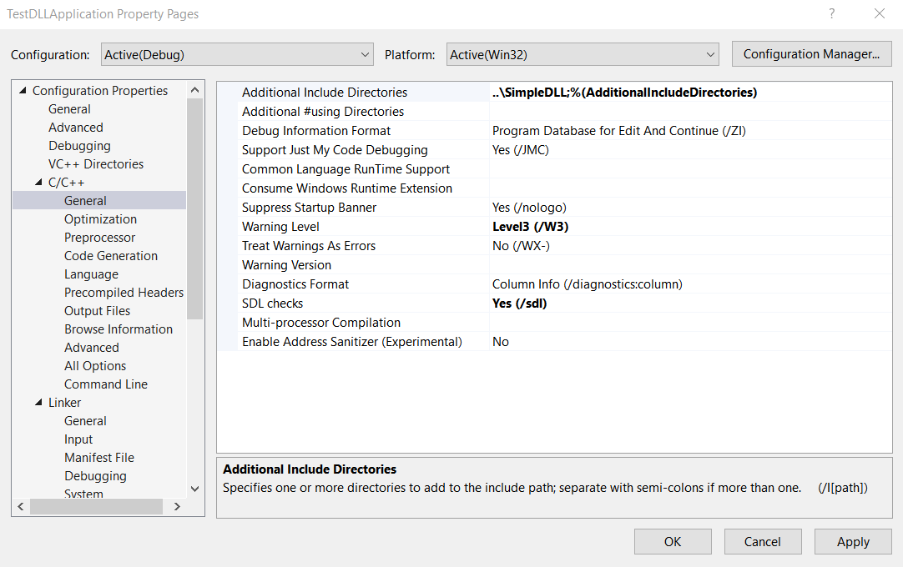
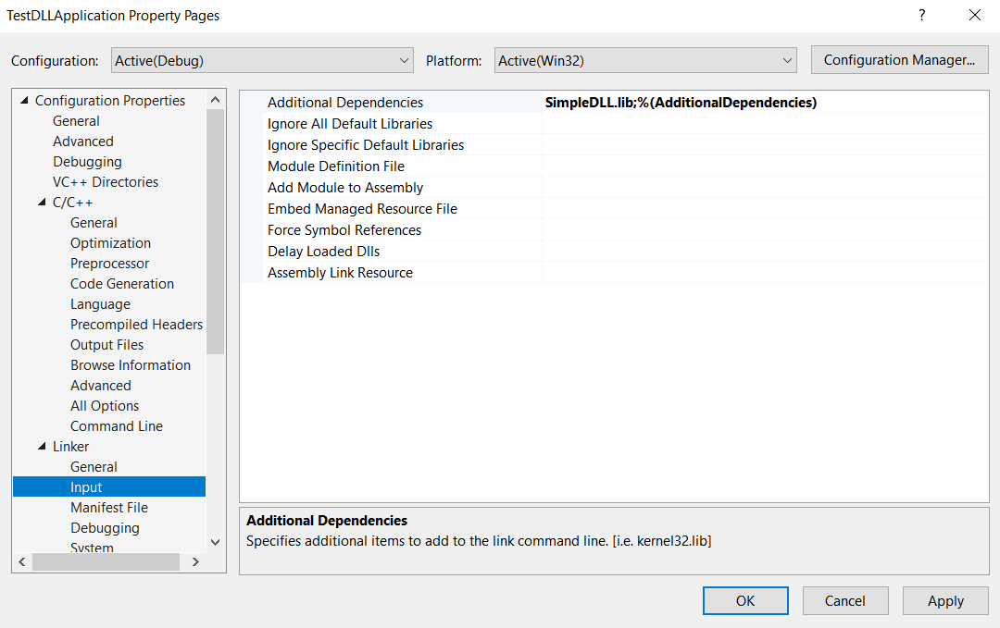
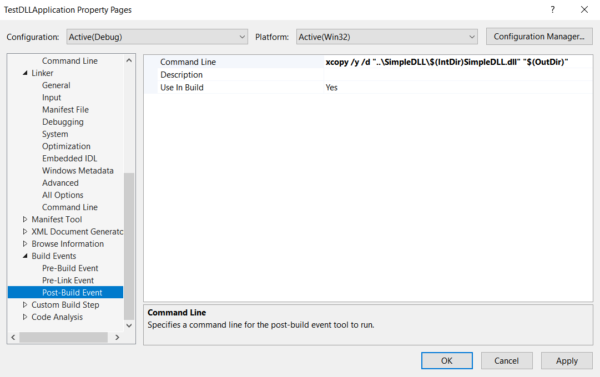
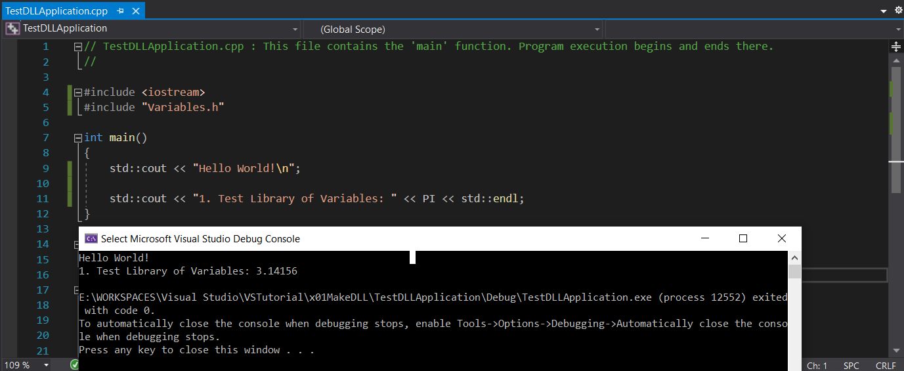
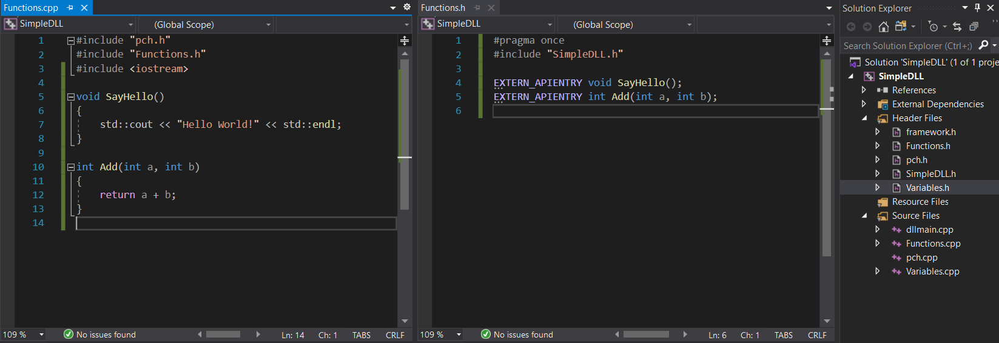
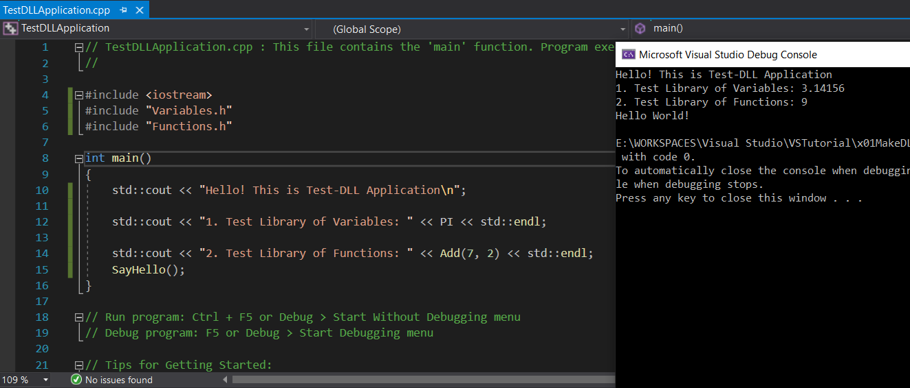
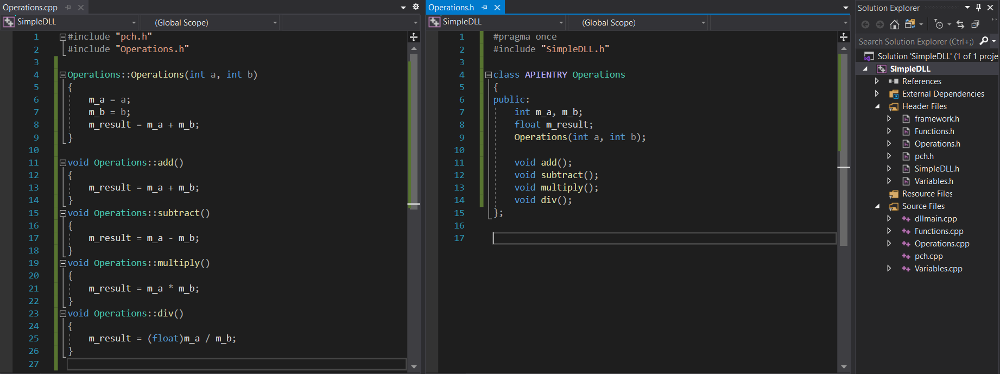
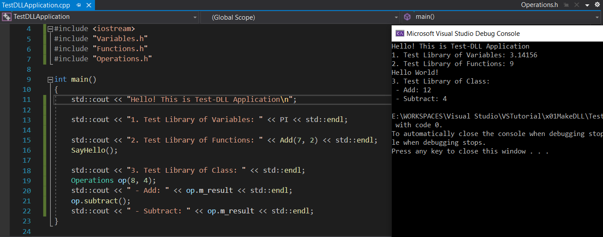

# Make DLL and use it in a Console Application

## Guidance:

### Steps to make a simple DLL:
 - create a project of `Dynamic-Link Library (DLL)`
 - define dll import/export(such as to create a header that defines APIENTRY & EXTERN APIENTRY like below):

 - now, to make a simple DLL library that provides a varible definition:

 - when build project, we get library files of *.dll and *.lib inside `Debug` folder. 3 files of library: *.h *.dll *.lib will be used for another applications.

 ### Steps for an application to use built DLL:
  - create a project of Console
  - then config the project:
    - link `<LIBRARY>.h` to project, by selecting `Configuration Properties > C/C++ > General` then edit `Additional Include Directories` field: `..\MathLibrary`

    - link `<LIBRARY>.dll & <LIBRARY>.lib` to project:
        - by selecting `Configuration Properties > Linker > General` then add to `Additional Library Directories`: `..\MathLibrary\$(IntDir)`

        - by selecting `Configuration Properties > Linker > Input` then add to `Additional Dependencies`: `MathLibrary.lib`

    - copy built `<LIBRARY>.dll` to project automatically each time it run(to update the latest version of library): `xcopy /y /d /f "..\SimpleDLL\$(IntDir)SimpleDLL.dll" "$(OutDir)"`

 - finally, to use the library, just include header file and call its exported variable like below:

### Steps to export dll function and to use it in an application is similar:
> just add `APIENTRY` or `EXTERN_APIENTRY` before function declaration inside header file.
 - create a new pair of *.h/*.cpp that defines 2 functions in *.cpp like below photo. In header file, add `EXTERN_APIENTRY` before function declaration:

 - after rebuild dll, the application just include new header file and call new functions like below:

### Steps to export dll of class and to use it in an application:
> It is similar to function exporting. Just different at using `APIENTRY` right after keyword `class` and before class name.
 - create a new class that defines its operations in *.cpp like below photo. In header file, add `APIENTRY` before the class name and right after keyword `class`:

 - after rebuild dll, the application just include new header file and use exported class as usual:

*!Notice:* It is able to export an individual method inside class like [Exporting Class Methods and Functions in Microsoft Visual Studio](https://zone.ni.com/reference/en-XX/help/370052AA-01/tsref/infotopics/exporting_in_net/)

## Reference source:
[Walkthrough: Create and use your own Dynamic Link Library (C++)](https://docs.microsoft.com/en-us/cpp/build/walkthrough-creating-and-using-a-dynamic-link-library-cpp?view=vs-2019)
