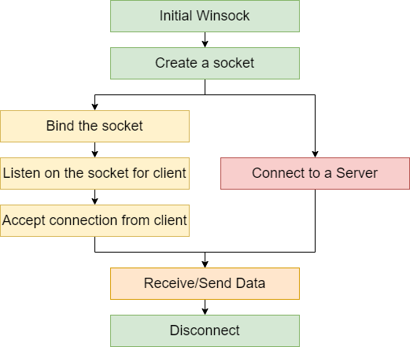

# Tcp Server & Client on VC++ using WinSock2
General mode for creating a streaming TCP/IP Server&Client:

Generally, the process of creating a TCP/IP streaming includes 5 steps(in there, 4 processes are the same):
 - Initialize the Winsock to use Winsock library
 - Create a socket
 - Create a server or Connect to a server:
    - the server needs 3 steps to establish connections:
        - Bind the socket
        - Listen on the socket
        - Accept the connection
    - the client just directly connect to the acknowledge server address
 - Send/Receive data
 - Disconnect the connection.

## Test guidance:
 - run SampleServer, the project will create a listening server on `127.0.0.1::27015`. It pends there to wait for a connection from client.
 - run the SampleClient, it will connect to the server and send a test message.
 - the server will receive the message, then automatically echo back to the client. Finally, it closes connection.
 - the client receive the echo message then it closes connection.

## Project explaination:
 - the 2 sample visual C++ project are based on [Getting Started with Winsock](https://docs.microsoft.com/en-us/windows/win32/winsock/getting-started-with-winsock#advanced-winsock-samples), [connect function](https://docs.microsoft.com/en-us/windows/win32/api/winsock2/nf-winsock2-connect) and [accept function](https://docs.microsoft.com/en-us/windows/win32/api/winsock2/nf-winsock2-accept).

## Future work:
 - to research [WSAAccept function](https://docs.microsoft.com/en-us/windows/win32/api/winsock2/nf-winsock2-wsaaccept) and [AcceptEx function](https://docs.microsoft.com/en-us/windows/win32/api/mswsock/nf-mswsock-acceptex?redirectedfrom=MSDN)

## Reference source:
 - [Microsoft sample](https://docs.microsoft.com/en-us/windows/win32/winsock/finished-server-and-client-code)
 - https://www.winsocketdotnetworkprogramming.com/winsock2programming/winsock2advancedcode1d.html
 - http://johnnie.jerrata.com/winsocktutorial/

