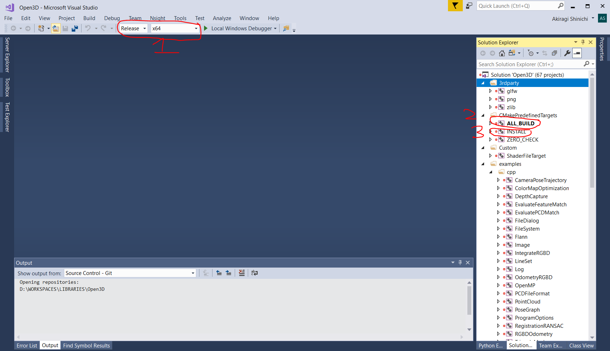
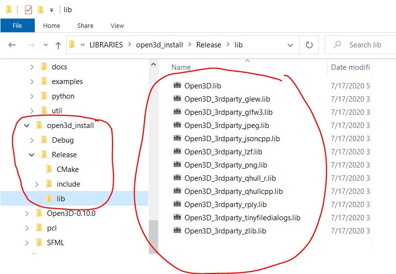
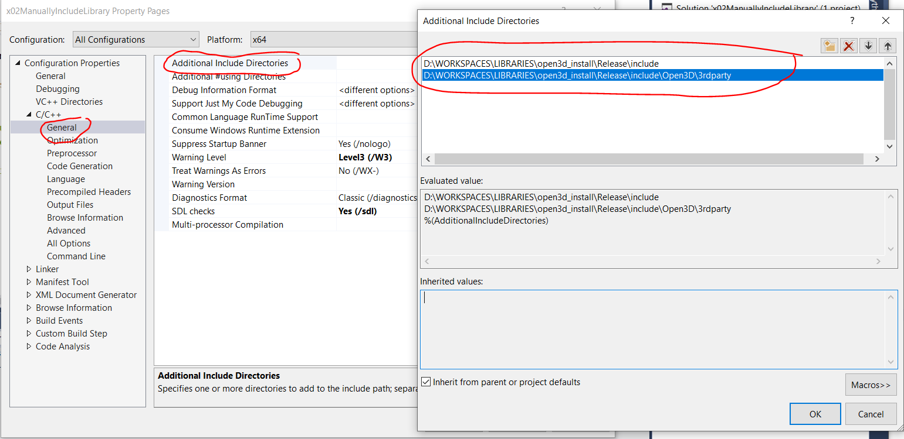
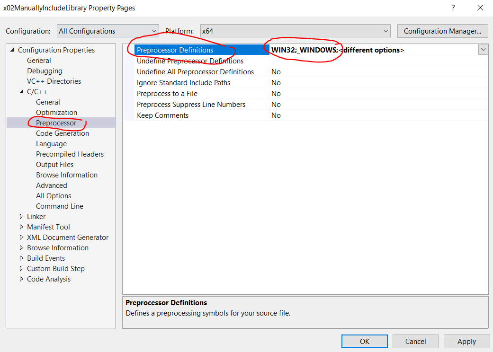
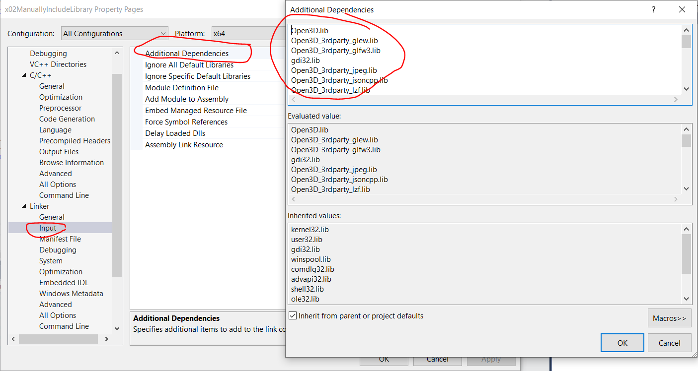
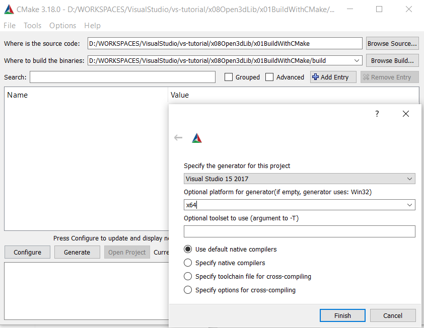
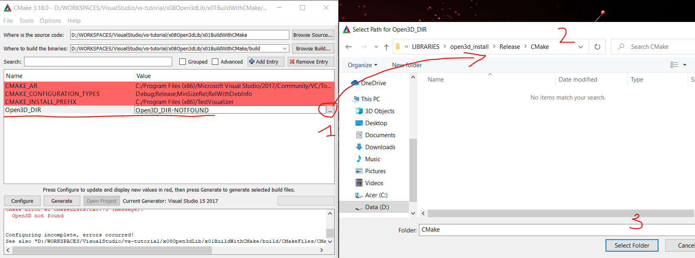

## Installation
> Below is the guide to build library from source by CMake

### [Build library from source](http://www.open3d.org/docs/release/compilation.html)
 - Open CMake-GUI, `Browse Source...` to folder of [`*.cpp`](x01BuildWithCMake/TestVisualizer.cpp) and [`CMakeLists.txt`](x01BuildWithCMake/CMakeLists.txt), `Browse Build...` to your expected folder. Such as: `D:/WORKSPACES/LIBRARIES/Open3D` & `D:/WORKSPACES/LIBRARIES/Open3D/Build/x64`.(**Atention:** on Windows Open3D is only able to build x64 version)
 - Then config path to `NPM`, path to `Python`, and where the library is created(`CMAKE_INSTALL_PREFIX`)

 - Afterward click `Configure` and `Generate` to create project of Open3D-library(in side `Browse Build...`).
 - Open built project by Visual Studio.
   - be sure correct build `Configuration`(`Release` or `Debug`) and `Platform`(`x64` or `x86`)
   - Build the `ALL_BUILD`
   - Build the `INSTALL`

 - Enjoy achievement!

## Usage
> There are 2 way to build project using the library

### Build project by including manually
 - `C/C++`->`Additional Include Directories`**:** `D:\WORKSPACES\LIBRARIES\open3d_install\Release\include;D:\WORKSPACES\LIBRARIES\open3d_install\Release\include\Open3D\3rdparty;%(AdditionalIncludeDirectories)`

 - `C/C++ -> Preprocessor`->`Preprocessor Definitions`**:** `WIN32;_WINDOWS;<different options>`

 - `Linker -> General`->`Additional Library Directories`**:** `D:\WORKSPACES\LIBRARIES\open3d_install\Release\lib;%(AdditionalLibraryDirectories)`

 - `Linker -> Input`->`Additional Dependencies`**:** `Open3D.lib;Open3D_3rdparty_glew.lib;Open3D_3rdparty_glfw3.lib;gdi32.lib;Open3D_3rdparty_jpeg.lib;Open3D_3rdparty_jsoncpp.lib;Open3D_3rdparty_lzf.lib;Open3D_3rdparty_png.lib;Open3D_3rdparty_zlib.lib;Open3D_3rdparty_rply.lib;Open3D_3rdparty_tinyfiledialogs.lib;Open3D_3rdparty_qhullcpp.lib;Open3D_3rdparty_qhull_r.lib;opengl32.lib;kernel32.lib;user32.lib;winspool.lib;shell32.lib;ole32.lib;oleaut32.lib;uuid.lib;comdlg32.lib;advapi32.lib;%(AdditionalDependencies)`

 - Finally, [in `*.cpp` include `Open3D.h` and run as usual](x02ManuallyIncludeLibrary/x02ManuallyIncludeLibrary/x02ManuallyIncludeLibrary.cpp).

*Sample*: [x02ManuallyIncludeLibrary](x02ManuallyIncludeLibrary)

### [Build project by CMake](http://www.open3d.org/docs/release/tutorial/C++/cplusplus_interface.html)
 - Open CMake-GUI, `Browse Source...` to folder of [`*.cpp`](x01BuildWithCMake/TestVisualizer.cpp) and [`CMakeLists.txt`](x01BuildWithCMake/CMakeLists.txt), `Browse Build...` to your expected folder. Such as: `D:/WORKSPACES/VisualStudio/vs-tutorial/x08Open3dLib/x01BuildWithCMake` & `D:/WORKSPACES/VisualStudio/vs-tutorial/x08Open3dLib/x01BuildWithCMake/build`

 - Then click `Configure`. This first-time will be failed. You need to configure `Open3D_DIR` to your built-Open3D folder. Such as: `D:/WORKSPACES/LIBRARIES/open3d_install/Release/CMake`.(**Attention:** `Debug` & `Release` is different. If your program will be run in `Debug` mode, please select `Debug` version of built-library.)

 - Click `Configure` again. This time it will be success.
 - Afterward, click `Generate` to create Visual Studio project.
 - Open project and run.

*Sample*: [x01BuildWithCMake](x01BuildWithCMake)
